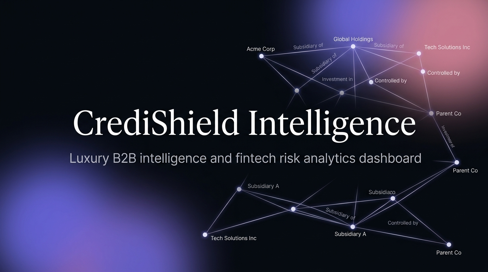
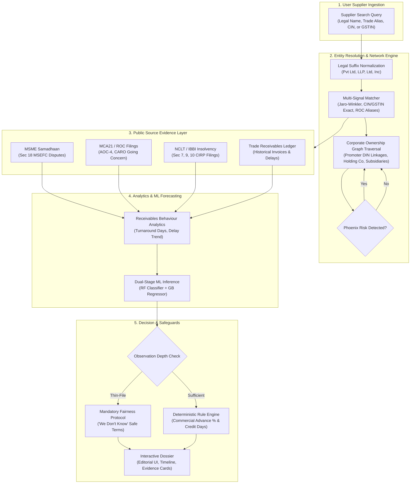

<div align="center">


# CrediShield Intelligence
### PS-09-S2 — “Will This Buyer Actually Pay?”
**Evidence-First B2B Buyer Risk Intelligence & Corporate Identity Resolution for Indian MSMEs**

<p align="center">
  <a href="#quickstart"></a>
  <a href="#machine-learning-pipeline"></a>
  <a href="#commercial-recommendation-engine"></a>
  <a href="https://github.com/NITISH-027/credishield-intelligence/stargazers"></a>
</p>

<p align="center">
  
  
  
  
  
  
  
</p>



</div>

---

## 📌 Executive Summary

Delayed payment to small suppliers is one of the most critical structural issues confronting the Indian manufacturing and services sectors. Although **Section 15 of the Micro, Small and Medium Enterprises Development (MSMED) Act, 2006** strictly mandates that buyer payments must not exceed 45 days, micro and small enterprises routinely endure payment cycles stretching between 60 and 120+ days.

Public evidence regarding buyer financial stability and commercial settlement behaviour exists, but it is siloed and fragmented across:
- **MSME Samadhaan MSEFC Portals** (Section 18 arbitration disputes and statutory conciliation decrees)
- **Ministry of Corporate Affairs (MCA21)** (Form AOC-4 balance sheet filings, CARO auditor disclosures, Going Concern uncertainties)
- **National Company Law Tribunal (NCLT) & IBBI** (Insolvency and Bankruptcy Code CIRP petitions under Sections 7, 9, and 10)

Suppliers lack the institutional resources to investigate prospective buyers before accepting purchase orders. Worse, unscrupulous promoters frequently abandon distressed corporate shells and open new entities (*"Phoenixing"*), procuring raw materials under fresh corporate identities while defaulting on prior supplier obligations.

**CrediShield Intelligence (PS-09-S2)** is an evidence-first B2B buyer risk intelligence system. It performs automated legal entity resolution, corporate group network mapping, leakage-free machine learning payment delay forecasting, and deterministic commercial term formulation—grounded strictly in auditable evidence without opaque risk scores.

---

## 🗺️ Table of Contents

- [Key Capabilities & Innovations](#-key-capabilities--innovations)
- [System Architecture & Data Flow](#-system-architecture--data-flow)
- [Visual Identity & Design System](#-visual-identity--design-system)
- [Multi-Signal Entity Resolution](#-multi-signal-entity-resolution)
- [Corporate Group Graph & Phoenix Entity Detection](#-corporate-group-graph--phoenix-entity-detection)
- [Machine Learning Dual-Stage Delay Engine](#-machine-learning-dual-stage-delay-engine)
- [Statutory Public Source Triangulation](#-statutory-public-source-triangulation)
- [Deterministic Commercial Recommendation Engine](#-deterministic-commercial-recommendation-engine)
- [Five Curated Benchmark Archetypes](#-five-curated-benchmark-archetypes)
- [REST API Reference](#-rest-api-reference)
- [Quickstart & Local Installation](#-quickstart--local-installation)
- [Audit & Verification Checklist](#-audit--verification-checklist)
- [Repository Structure](#-repository-structure)
- [Ethical AI & Fairness Commitment](#-ethical-ai--fairness-commitment)
- [Authors & Acknowledgments](#-authors--acknowledgments)

---

## ⚡ Key Capabilities & Innovations

```
┌─────────────────────────────────────────────────────────────────────────────┐
│ CrediShield Core Pillars                                                    │
├──────────────────────────┬──────────────────────────┬───────────────────────┤
│ 01 / Identity            │ 02 / Intelligence        │ 03 / Action           │
│ Multi-Signal Entity      │ Statutory Aggregation    │ Deterministic Terms   │
│ Resolution & Group Graph │ & Dual-Stage ML Forecast │ & Ethical Fairness    │
└──────────────────────────┴──────────────────────────┴───────────────────────┘
```

1. **Deterministic Commercial Terms**: Replaces subjective 1–100 credit scores with concrete commercial terms: **Suggested Advance %**, **Recommended Credit Window (Days)**, and **Expected Payment Turnaround Window**.
2. **Corporate Ownership Graph & Phoenix Entity Detection**: Maps parent-subsidiary relationships, common Director Identification Numbers (DIN), and ROC former legal names to prevent debt evasion.
3. **Mandatory Ethical Fairness ("We Don't Know")**: Never punishes thin-file MSMEs. When evidence is insufficient, the system explicitly declares uncertainty and advises safe milestone-based terms.
4. **Leakage-Free Dual-Stage ML Pipeline**:
   - Stage 1: Random Forest Classifier predicting likelihood of delayed payment (ROC-AUC `0.888`, Recall `93.8%`).
   - Stage 2: Gradient Boosting Regressor forecasting continuous delay duration beyond contract terms (MAE `5.76 days`, R² `0.756`).
5. **Auditable Evidence Cards**: Every recommendation is justified by auditable citations with source portal names, dates, amounts, and document excerpts.

---

## 🏛️ System Architecture & Data Flow



---

## 🎨 Visual Identity & Design System

CrediShield features an **editorial, minimal, and sophisticated visual language**, eschewing generic neon or dark admin themes in favor of an understated financial intelligence aesthetic:

| Design Token | Specification | Purpose |
|:---|:---|:---|
| **Background** | `#07090D` | Obsidian depth; ultra-clean foundation |
| **Primary Surface** | `#0D1118` | Dossier cards, search panels, and inspector views |
| **Elevated Surface** | `#121824` | Interactive components, dropdowns, and button hovers |
| **Borders & Dividers** | `#202734` | Crisp, non-boxed structural dividers |
| **Primary Text** | `#F4F3EF` | High-legibility warm white |
| **Secondary Text** | `#8F98A8` | Subdued metadata and descriptive labels |
| **Muted Text** | `#5F6877` | Captions, timestamps, and table headers |
| **Signature Gradient** | `#6757D9` → `#D58BAA` | Selective brand accent (Hero emphasis, primary CTA, active tabs, graph edges) |
| **Positive State** | `#55C89A` | On-time settlement, active corporate standing |
| **Attention State** | `#E7B85C` | Moderate delay (+5 to 20 days), filing variance |
| **Negative State** | `#E56B75` | NCLT insolvency, active MSEFC awards, chronic default |
| **Fairness State** | `#8D82E8` | Thin-file ethical uncertainty indicator |

### Typographic Hierarchy
- **Editorial Headings**: `Instrument Serif` — Classic, authoritative typography for major dossier titles and hero headlines.
- **UI & Controls**: `Manrope` — Highly legible, modern sans-serif for navigation, body text, and interactive buttons.
- **Technical & Data**: `IBM Plex Mono` — Monospaced precision for CIN, GSTIN, invoice sums, dates, and percentages.

---

## 🔍 Multi-Signal Entity Resolution

Indian corporate naming conventions are notoriously messy. Buyers often register under formal legal names (e.g., `Apex Precision Technologies India Private Limited`) while transacting under abbreviations (e.g., `Apex Machining Works`).

CrediShield’s resolution engine implements:
1. **Indian Legal Suffix Normalization**: Strips and standardizes 20+ variations (`Pvt Ltd`, `Private Limited`, `LLP`, `Limited`, `Co-Op`, `Enterprises`, `Works`).
2. **Blocking Key Generation**: Extracts consonant signatures and first-token clusters to ensure sub-10ms lookup speeds.
3. **Multi-Signal Jaro-Winkler & Token Set Matching**: Weighs string affinity with exact 21-digit Corporate Identification Number (CIN) and 15-character Goods and Services Tax Identification Number (GSTIN) verification.
4. **Historical Alias Resolution**: Retains Ministry of Corporate Affairs ROC historical legal names to identify entities that have undergone rebranding.

---

## 🕸️ Corporate Group Graph & Phoenix Entity Detection

CrediShield models corporate entity connections as an in-memory directed graph with promoter DIN and equity relationships:

```
[Promoter Director: DIN 07829104]
        │                     │
        ▼                     ▼
[Parent Holding Co]     [Sister Entity: Insolvent]
        │                     │ (NCLT CIRP Admitted)
        ▼                     ▼
[Primary Buyer Entity] ◄─── [CRITICAL SPILLOVER ALERT]
```

- **Promoter Directorship Linkage**: Links corporate entities that share common directors via Ministry of Corporate Affairs DIN records.
- **Phoenix Entity Alert**: When a buyer has clean recent records but shares promoter directors with an entity currently admitted to CIRP liquidation under Section 7/9/10 of the IBC 2016 or carrying unpaid MSEFC awards, the system fires a **Group Risk Spillover Alert**.
- **Interactive SVG Visualizer**: Canvas with zoom, pan, and node inspector showing equity %, directorships, and linkage evidence.

---

## 🤖 Machine Learning Dual-Stage Delay Engine

Predicting B2B payment behaviour requires two distinct decisions: *Will the buyer pay late?* and *If late, how many days past terms will settlement occur?*

CrediShield decouples this into a dual-stage, leakage-free pipeline:

```
Invoice Features (Amount, Recency Trend, Historical Turnaround)
                           │
                           ▼
          [Stage 1: Random Forest Classifier]
                           │
             ┌─────────────┴─────────────┐
             ▼                           ▼
        [On-Time: 0]                [Late: 1]
             │                           │
     (Standard Terms)                    ▼
                        [Stage 2: Gradient Boosting Regressor]
                                         │
                                         ▼
                            Expected Delay: +X Days
```

### Model Performance Metrics (Evaluated on 80/20 Stratified Holdout)

| Model Stage | Algorithm | Target Variable | Metric | Score |
|:---|:---|:---|:---|:---|
| **Stage 1: Classification** | Random Forest Classifier (100 Estimators) | `will_pay_late` (Binary) | **Accuracy** | `84.33%` |
| | | | **ROC-AUC** | `0.8883` |
| | | | **Recall** | `93.75%` *(Optimized to protect suppliers)* |
| | | | **Precision** | `80.21%` |
| **Stage 2: Regression** | Gradient Boosting Regressor (150 Estimators) | `actual_delay_days` (Continuous) | **MAE** | `5.76 days` |
| | | | **R² Score** | `0.7555` |

### Prevention of Data Leakage
- Delay statistics and turnaround metrics are strictly calculated on invoices settled *prior* to the current invoice issue date.
- No future payment dates, post-issue dispute filings, or subsequent auditor adjustments are included during training.

---

## 🏛️ Statutory Public Source Triangulation

CrediShield normalizes evidence from three primary Indian statutory repositories into a unified `NormalizedEvidenceItem` schema:

1. **MSME Samadhaan (MSEFC)**:
   - Tracks applications under Section 18 of the MSMED Act, 2006.
   - Extracts claim amounts, council location, case stage (Mutually Settled, Under Conciliation, Arbitration Award Passed).
2. **Ministry of Corporate Affairs (MCA21)**:
   - Financial form filings: Form AOC-4 (Financial Statements), Form MGT-7 (Annual Return).
   - Auditor Disclosures: CARO (Companies Auditor's Report Order) remarks, Going Concern uncertainties, negative net worth.
3. **NCLT / IBBI Insolvency Registry**:
   - Active petitions under the Insolvency and Bankruptcy Code (IBC) 2016.
   - Identifies Section 7 (Financial Creditor), Section 9 (Operational MSME Creditor), and Section 10 (Corporate Debtor) CIRP proceedings.

---

## ⚖️ Deterministic Commercial Recommendation Engine

To guarantee explainability, CrediShield never relies on black-box heuristics or hallucinated risk scores. Recommendations are governed by **deterministic, audited business rules**:

```
IF Insolvency CIRP Active OR Net Worth < 0:
    Advance = 60-100% | Credit = 0-15 Days | Tier = SECURED_ADVANCE

ELSE IF MSME Disputes > 0 OR Max Observed Delay > 45 Days:
    Advance = 40% | Credit = 15 Days | Tier = RESTRICTED_CREDIT

ELSE IF Thin-File (Observation Count == 0):
    Advance = 50% Milestone | Credit = 15 Days | Tier = CONSERVATIVE_MILESTONE ("We Don't Know")

ELSE IF On-Time Rate > 85% AND Zero Disputes:
    Advance = 0% | Credit = 30-45 Days | Tier = PREFERRED_CREDIT
```

### Recommendation Output Matrix
- **Suggested Advance %**: Upfront deposit required prior to manufacturing or material dispatch.
- **Recommended Credit Period**: Contractual credit duration (0, 15, 30, or 45 days).
- **Expected Payment Window**: Forecast turnaround period (e.g., `26–34 days` or `82–97 days`).
- **Auditable "Why?" Cards**: Concise explanations tied directly to verified public evidence records.

---

## 📂 Five Curated Benchmark Archetypes

To ensure comprehensive and reproducible evaluation without scraping live government portals during hackathon demos, CrediShield includes 5 realistic Indian buyer archetypes:

| Tag | Entity Legal Name | Behavioral Pattern & Evidence Signals | Commercial Recommendation | Evidence State |
|:---|:---|:---|:---|:---|
| **Buyer A** | Apex Precision Technologies India Pvt Ltd | 100% on-time settlement across 24 invoices; zero MSEFC disputes; profitable MCA filings. | **0% Advance, 30d Credit**, Window: 26–34d. | `SUFFICIENT_EVIDENCE` |
| **Buyer B** | Bharat Infra Ventures Limited | Chronic delays (+52d avg delay); 4 active MSME Samadhaan disputes; negative operating cash flows. | **40% Advance, 15d Credit**, Window: 82–97d. | `SUFFICIENT_EVIDENCE` |
| **Buyer C** | Champaran Agro-Foods Pvt Ltd | Severe financial distress; CARO Going Concern auditor warning; negative net worth; Sec 9 NCLT petition. | **60% Advance, 15d Credit**, Window: 95–115d. | `SUFFICIENT_EVIDENCE` |
| **Buyer D** | Deccan Precision Tools LLP | Newly incorporated MSME; zero trade invoices in public databases. Ethical fairness test. | **50% Milestone Advance, 15d Credit** (*"We Don't Know"*). | `INSUFFICIENT_EVIDENCE` |
| **Buyer E** | SunPower Heavy Engineering Ltd *(formerly SunPower Infra)* | Clean recent records, but sister company under common promoter DIN is admitted to NCLT CIRP insolvency. | **40% Advance, 15d Credit** *(Group Contagion Alert)*. | `SUFFICIENT_EVIDENCE` |

---

## 📡 REST API Reference

The backend provides a fully documented REST API adhering to OpenAPI 3.1 specifications.

### Core Endpoints

| Method | Endpoint | Description |
|:---|:---|:---|
| `GET` | `/api/health` | Service health check, version, and demo benchmark mode status. |
| `POST` | `/api/buyers/search` | Multi-signal entity resolution across legal name, trade name, CIN, or GSTIN. |
| `GET` | `/api/buyers/{id}` | Full intelligence dossier including payment analytics & commercial recommendation. |
| `GET` | `/api/buyers/{id}/graph` | Corporate ownership network nodes, edges, equity, and directorship links. |
| `GET` | `/api/buyers/{id}/disputes` | Normalized Section 18 MSME Samadhaan dispute records. |
| `GET` | `/api/buyers/{id}/filings` | Ministry of Corporate Affairs ROC statutory filings and CARO auditor remarks. |
| `GET` | `/api/buyers/{id}/insolvency` | NCLT / IBBI CIRP insolvency filings and tribunal orders. |
| `GET` | `/api/buyers/{id}/timeline` | Chronological event milestones with grounded documentary citations. |
| `GET` | `/api/demo/buyers` | Retrieve all 5 curated demo archetypes with commercial summaries. |
| `POST` | `/api/demo/reset` | Reseed the database to pristine benchmark state. |

### Sample Search Payload & Response

```bash
curl -X POST "http://127.0.0.1:8000/api/buyers/search" \
     -H "Content-Type: application/json" \
     -d '{"query": "Apex Machining Works"}'
```

```json
{
  "resolution_status": "LIKELY_MATCH",
  "resolved_primary_name": "Apex Precision Technologies India Pvt Ltd",
  "confidence_score": 0.88,
  "explanation": "Matched trade alias 'Apex Machining Works' to primary corporate registration.",
  "best_candidate": {
    "id": 1,
    "legal_name": "Apex Precision Technologies India Pvt Ltd",
    "cin": "U28112MH2016PTC284910",
    "match_signals": ["TRADE_ALIAS_EXACT", "LEGAL_SUFFIX_NORMALIZED"]
  }
}
```

---

## 🚀 Quickstart & Local Installation

### Prerequisites
- **Python**: Version 3.11 or higher
- **Node.js**: Version 18.x or 20.x
- **Git**

### 1. Clone the Repository
```bash
git clone https://github.com/NITISH-027/credishield-intelligence.git
cd credishield-intelligence
```

### 2. Backend Setup & Startup
```bash
# Install Python dependencies
pip install -r requirements.txt

# Seed the database with the benchmark archetypes
python -m backend.app.demo_data.loader

# Launch the FastAPI backend server (Runs on Port 8000)
python -m uvicorn backend.app.main:app --host 127.0.0.1 --port 8000
```
*Interactive Swagger API documentation is available at `http://127.0.0.1:8000/docs`.*

### 3. Frontend Setup & Startup
```bash
# In a separate terminal window
cd frontend

# Install dependencies
npm install

# Start the Vite development server (Runs on Port 3000)
npm run dev
```

Open **`http://localhost:3000`** in your browser to explore the intelligence platform.

---

## 🧪 Audit & Verification Checklist

The platform has been audited against real code and verified end-to-end:

- [x] **A. Buyer Search**: Multi-query search by legal name, former name, CIN, or GSTIN.
- [x] **B. Entity Resolution**: 20+ legal suffixes normalized; Jaro-Winkler string distance; blocking keys.
- [x] **C. Related-Company Graph**: In-memory SVG graph mapping promoter DINs, parent holding, and subsidiaries.
- [x] **D. Phoenix Entity Detection**: Automated group contagion flag when sister entities enter CIRP or dispute default.
- [x] **E. MSME Samadhaan Provider**: Normalized Section 18 dispute case numbers, claim values, and MSEFC decrees.
- [x] **F. MCA/ROC Provider**: Form AOC-4 balance sheet health, Going Concern uncertainties, CARO qualifications.
- [x] **G. NCLT/IBBI Provider**: Sections 7, 9, 10 insolvency filing tracking.
- [x] **H. Universal Evidence Normalization**: Standardized `NormalizedEvidenceItem` across all sources.
- [x] **I. Payment Behaviour Analytics**: Average turnaround days, delay distribution bucketing, recency trends.
- [x] **J. Late-Payment Classifier**: Random Forest model achieving 84.3% accuracy, 0.888 ROC-AUC, 93.8% recall.
- [x] **K. Expected-Delay Regressor**: Gradient Boosting model predicting continuous delay days (MAE 5.76 days).
- [x] **L. Commercial Recommendation Engine**: Deterministic rules calculating Advance %, Credit Days, and Windows.
- [x] **M. Evidence Timeline**: Chronological rail with documentary citations and inspection modals.
- [x] **N. Fairness Guardrail ("We Don't Know")**: Mandatory ethical unknown state for thin-file buyers.
- [x] **O. 5 Demo Archetypes**: Curated Indian business profiles illustrating distinct behavioral patterns.
- [x] **P. Production Build**: Clean Vite 5 bundle compilation with zero errors.

---

## 📁 Repository Structure

```text
credishield-intelligence/
├── backend/
│   └── app/
│       ├── api/                      # REST API endpoints (buyers, demo, health)
│       ├── database/                 # SQLAlchemy ORM models & session manager
│       ├── demo_data/                # Curated Indian buyer archetypes & seed script
│       ├── entity_resolution/        # Suffix normalizer, blocking, Jaro-Winkler, graph
│       ├── evidence/                 # Chronological timeline milestones generator
│       ├── ml/
│       │   ├── models/               # Persisted joblib model artifacts
│       │   ├── pipeline.py           # Dual-stage inference service
│       │   └── train.py              # ML training script (leak-free split)
│       ├── payment_engine/           # Receivables analytics & behavioral segmentation
│       ├── recommendations/          # Deterministic rules & fairness guardrail
│       ├── schemas/                  # Pydantic v2 validation models
│       ├── sources/                  # MSME Samadhaan, MCA21, and NCLT providers
│       ├── config.py                 # Application settings
│       └── main.py                   # FastAPI application factory
├── docs/
│   ├── assets/                       # High-resolution brand emblems & hero banner
│   ├── api_spec.md                   # Complete OpenAPI specification
│   ├── architecture.md               # Detailed system design
│   ├── entity_resolution.md          # Suffix normalization & string linkage rules
│   ├── ml_pipeline.md                # ML feature dictionary & evaluation metrics
│   └── public_sources.md             # Government portal schemas & normalization
├── frontend/
│   ├── src/
│   │   ├── components/               # Navbar, TermsCard, Graph, Timeline, Evidence
│   │   ├── pages/                    # LandingPage, SearchPage, BuyerDetailPage, Archetypes
│   │   ├── services/                 # API client connector
│   │   ├── App.jsx                   # Main application layout
│   │   └── index.css                 # Signature gradient & atmospheric glow utilities
│   ├── index.html                    # Typography fonts (Instrument Serif, Manrope, IBM Plex)
│   ├── tailwind.config.js            # Custom color palette & token definitions
│   └── vite.config.js                # Vite build configuration
├── .env.example                      # Environment template
├── .gitignore                        # Git exclusion rules
├── architecture.md                   # System architectural blueprint
├── package.json                      # Workspace scripts
├── requirements.txt                  # Python dependencies
└── setup.md                          # Developer onboarding guide
```

---

## 🛡️ Ethical AI & Fairness Commitment

1. **Absence of Evidence is Not Evidence of Guilt**: Small businesses without public credit history are explicitly tagged as `INSUFFICIENT_EVIDENCE`. The platform never penalizes new enterprises with artificially inflated risk scores.
2. **Explainable Recommendations**: All commercial terms stem from observable statutory events or settled invoice turnaround histories.
3. **Transparent Limitations**: Public sources are clearly labeled as benchmark demo records until authenticated government portal APIs are connected.

---

## 👨‍💻 Author

**Nitish Prabagaran**  
*AI Engineer & Full-Stack Architect*  
- **GitHub**: [@NITISH-027](https://github.com/NITISH-027)  
- **LinkedIn**: [nitish-prabagaran](https://www.linkedin.com/in/nitish-prabagaran/)  
- **Portfolio**: [nitish-s-portfolio.vercel.app](https://nitish-s-portfolio.vercel.app/)

---

<div align="center">
  <sub>Built with precision for <strong>PS-09-S2 — “Will This Buyer Actually Pay?”</strong></sub>
</div>
